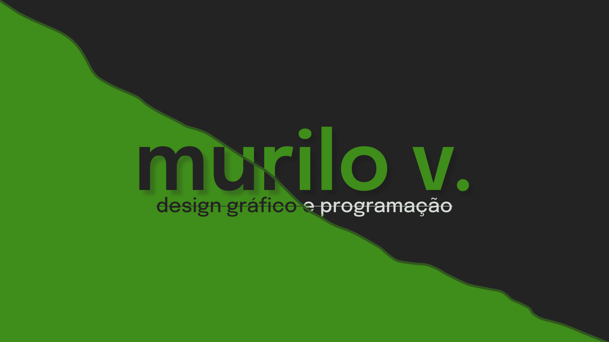

<h1 align="center">
    
</h1>

# Hello, you is welcome to explore the repositories in this profile ;)

## About

I love programming and being able to use my design experience to create beautiful and easy projects is a pleasure. Visit the website below to get to know me better.

<a href="https://murilo-v.netlify.app/">🔗 Click here</a>